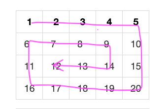
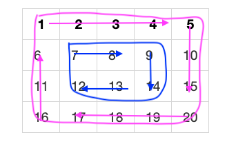

[54. 螺旋矩阵](https://leetcode-cn.com/problems/spiral-matrix/)
给你一个 m 行 n 列的矩阵 matrix ，请按照 顺时针螺旋顺序 ，返回矩阵中的所有元素。

 

**示例 1：**

```
输入：matrix = [[1,2,3],[4,5,6],[7,8,9]]
输出：[1,2,3,6,9,8,7,4,5]
```
**示例 2：**

```
输入：matrix = [[1,2,3,4],[5,6,7,8],[9,10,11,12]]
输出：[1,2,3,4,8,12,11,10,9,5,6,7]
```

**提示：**

- m == matrix.length
- n == matrix[i].length
- 1 <= m, n <= 10
- -100 <= matrix[i][j] <= 100


## 解法1：螺旋式遍历

由于矩阵内部都是数组，并且范围是在`-100`到`100`之前的整数，因此考虑将遍历过的数字标记为`1.01`(只要不是题目要求的数字范围都可以)

指针从左上角开始，行走之前先试探下一步是否满足两个条件
- 1.是否触达边界
- 2.是否是已读数字`1.01`

满足上面连个条件就要顺时针调整方向，这里使用二位数组表示方向`[[0,1], [1,0], [0,-1], [-1, 0]]`
- `[0,1]`:向右
- `[1,0]`:向下
- `[0,-1]`:向左
- `[-1,0]`:向上
每走到一个位置就增加统计次数`count`,直到`count=length`(length是矩阵的元素总个数)

**代码**
```js
/**
 * 思路：按照螺旋路径遍历
 * 1.指针的方向是`右下左上`不停的循环，方向使用二位数组表示`[[0,1], [1,0], [0,-1], [-1, 0]]`
 * 2.遍历次数等于矩阵元素总个数时停止
 * 3.指针走到边界处或已读位置时调整方向,为了让指针不越界，将指针对4取余`(pointer+1)%4`
 * @param matrix 
 */
const spiralOrder = (matrix: number[][]): number[] => {
    const READED = 1.01;// 已读标记
    const DIRECTIONS: number[][] = [[0,1], [1,0], [0,-1], [-1, 0]];// 方向
    const TOTAL = matrix.length * matrix[0].length;// 矩阵总元素个数
    let pointer = 0;// 控制方向的指针
    let count = 0;// 循环次数
    let i = 0, j = 0;
    const res: number[] = []
    while(count < TOTAL){
        res.push(matrix[i][j]);
        count ++;
        matrix[i][j] = READED;// 已读
        const next = [i + DIRECTIONS[pointer][0], j + DIRECTIONS[pointer][1]];// 按照当前方向尝试走下一步
        // 如果下一步到了边界，或者之前已读过的位置，则调整方向
        if (matrix[next[0]] === undefined || matrix[next[0]][next[1]] === READED || matrix[next[0]][next[1]] === undefined) {
            pointer = (pointer +1) % 4;// 改变方向
        }
        i += DIRECTIONS[pointer][0];
        j += DIRECTIONS[pointer][1];
    }
    return res
}
// 测试：
spiralOrder([
    [1,2,3,4,5],
    [6,7,8,9,10],
    [11,12,13,14,15],
    [16,17,18,19,20],
])
```


## 解法2：按层遍历
我们将二位矩阵想象成一个洋葱切面

每扒掉一层皮，矩阵就小一层，。不过洋葱是圆的，我们的矩阵是方形的，因此要确定没层皮的四个角上的点。

其实很简单，对角线上的两个点就能确定这层皮的框框，记录左上角`[top,left]`,右上角`[bottom,right]`

一层层扒下去，直到`top === bottom`或者`left === right`结束



**代码**
```js
/**
 * 思路
 * 1.像剥洋葱似的一层层扒皮
 * 2.通过对角线的两个点确定每层皮四个点
 * @param matrix 
 */
const spiralOrder1 = (matrix: number[][]): number[] => {
    const res: number[] = [];
    // 根据对角线就可以确定矩阵的四个边
    let top = 0, left = 0, bottom = matrix.length-1, right = matrix[0].length-1;
    // 扒皮
    while(top < bottom && left < right){
        // 左 -> 右（上边）
        for (let l = left; l < right;l++) {
            res.push(matrix[top][l])
        }
        // 上 -> 下（右边）
        for (let i = top; i < bottom; i++) {
            res.push(matrix[i][right])
        }
        // 右 -> 左（下边）
        for (let i = right;i > left;i--) {
            res.push(matrix[bottom][i])
        }
        // 下 -> 上（左边）
        for (let i = bottom; i > top; i--) {
            res.push(matrix[i][left])
        }
        // 往里进一层
        top ++;
        left ++;
        bottom --;
        right --
    }
    return res;
}

// 测试：
spiralOrder1([
    [1,2,3,4,5],
    [6,7,8,9,10],
    [11,12,13,14,15],
    [16,17,18,19,20],
])
spiralOrder1([
    [1,2,],
    [6,7,],
    [11,12,],
    [16,17,],
])
```

## 复杂度对比
矩阵元素个数为`n`,返回值不计入复杂度

**解法1**
- 时间复杂度：O(n)
- 空间复杂度：O(1)

**解法2**
虽然里面有4个for循环，但是不会出现重复遍历的元素，因此时间复杂度是元素的数量
- 时间复杂度：O(n)
- 空间复杂度：O(1)

两个相比较，我感觉解法2更好一些，使用的变量少

# 思路扩展
先增加一个[100x100的二位矩阵](https://raw.githubusercontent.com/shared-code-development/show-you-my-code/master/javascript/src/code/147/matrix_100.json)的测试用例

思考一个问题，矩阵数据特别大，无法一次性加载到内存中，应该如何进行螺旋遍历呢？

**欢迎提出解答方案**
