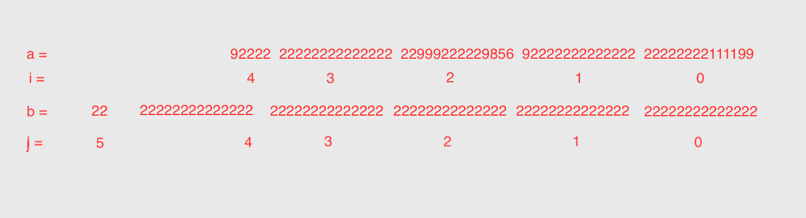

**题目：**
两个非负数的大数相加，求和

**示例1：**

```
a = "9222222222222222222229992222298569222222222222222222222111199";
b = "222222222222222222222222222222222222222222222222222222222222222222222222"

求和：
a + b = "222222222231444444444444444444452214444520789444444444444444444444333421"
```


考虑到JavaScript最大安全整形数字是`Number.MAX_SAFE_INTEGER`,也就是`9007199254740991`,这个最大数字是16位数。

两个15位的大数相加之和可能超过这个数字，因此选择14位是最安全的。

**思路：**
将每个数字以14位为一组进行拆分，因此可将示例中数字拆分,从后向前拆分，不足14位的单独一组



如果每组数组相加位数超过14位，则进制位加1，`bit = 1`

`a[1] + b[1] = 92222222222222 + 22222222222222 = 114444444444444`

将首位`1`去除，得`14444444444444`

**详细代码**
```JavaScript
const twoBigintSum1 = (a: string, b: string): string => {
    console.log(a)
    console.log(b)
    // 考虑到最大数为16位，`Number.MAX_SAFE_INTEGER = 9007199254740991`
    // 将字符串每14位拆分为一组
    let i = a.length, j = b.length, res = '', bit = 0;
    while(i > 0 || j > 0) {
        const stra: string = i > 0 ? a.slice(i - 14 > 0 ? i - 14 : 0, i) : '';// a[i]
        const strb: string = j > 0 ? b.slice(j - 14 > 0 ? j - 14 : 0, j) : '';// b[j]
        const sum: string = String(Number(stra) + Number(strb));// 求和
        if (sum.length === 15) {
            res = (Number(sum.slice(1)) + bit) + res;// 删掉首位数字
            bit = 1;
        } else {
            res = (Number(sum) + bit) + res;
            bit = 0;
        }
        i -= 14;
        j -= 14;
    }
    return bit === 1 ? 1 + res : res;
}
```
